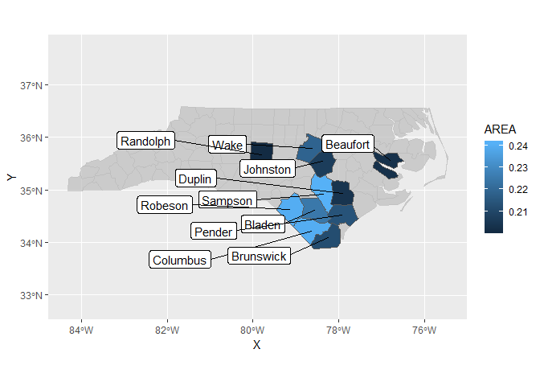

<!-- README.md is generated from README.Rmd. Please edit that file -->
Yutani's utilities
==================

[](https://travis-ci.org/yutannihilation/yutanutils)

This utilities are for me, but they might be useful for you.

Installation
------------

``` r
# install.packages("devtools")
devtools::install_github("yutannihilation/yutanutils")
```

Usage
-----

### Labels

``` r
library(ggplot2)
library(yutanutils)

nc <- sf::st_read(system.file("shape/nc.shp", package = "sf"), quiet = TRUE)

ggplot(head(nc, 3)) +
  geom_sf(aes(fill = AREA)) +
  geom_sf_label(aes(label = NAME), seed = 10)
#> Warning in st_point_on_surface.sfc(data$geometry): st_point_on_surface may
#> not give correct results for longitude/latitude data
```


``` r

library(gghighlight)

ggplot(nc) +
  geom_sf(aes(fill = AREA)) +
  gghighlight(AREA > 0.20) +
  geom_sf_label_repel(aes(label = NAME), seed = 10)
#> Warning in st_point_on_surface.sfc(data$geometry): st_point_on_surface may
#> not give correct results for longitude/latitude data
```


